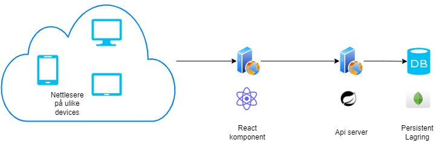
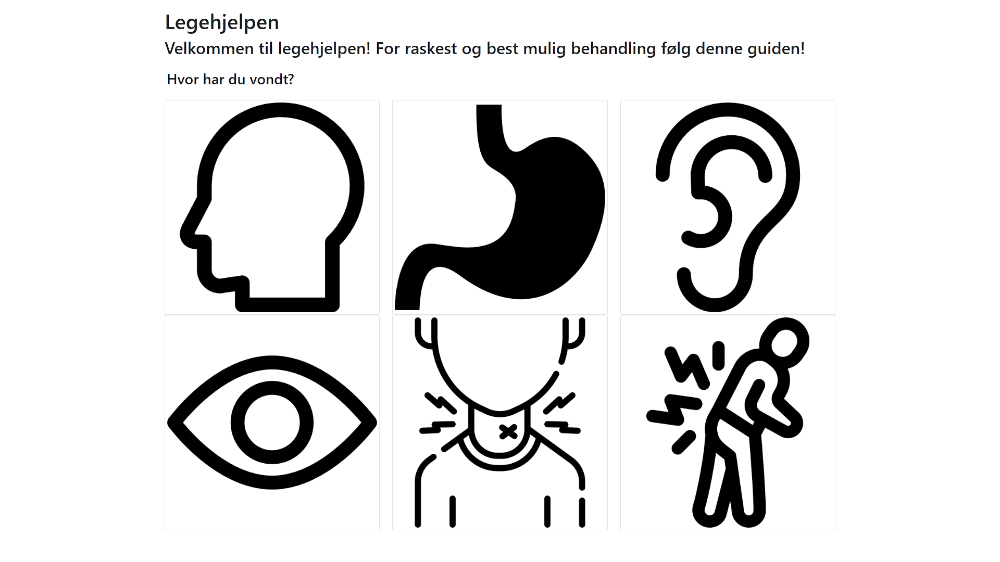

# Legehjelpen
Applikasjon for å hjelpe legen i sitt daglige arbeid.

## Hvordan komme i gang?
Installer jdk17
Installer nvm
Installer node 16 (LTS)

## Hva trenger du?
Jdk 17 med kotlin og node 16. 

## Enkel arkitektur 

## Backend
Prosject basert på spring boot og kotlin 

## Frontend
Prosject basert på react app og bootstrap. 
Slik ser forsiden ut:
